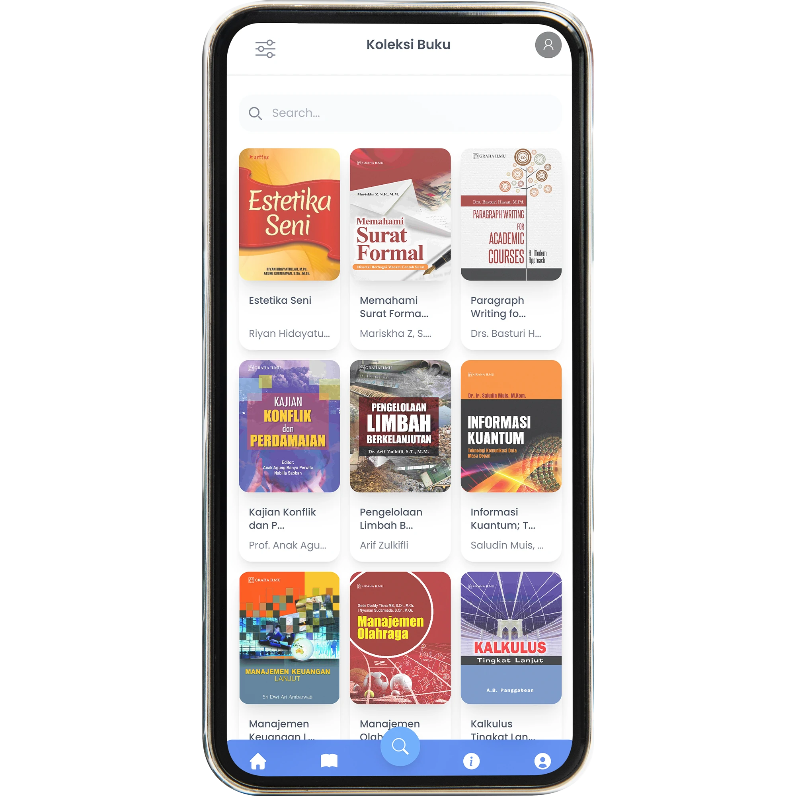
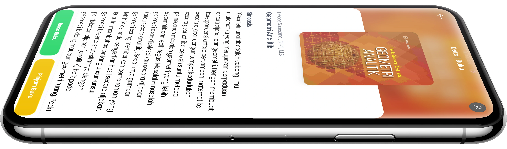

<head>
    <title>Perpustakaan Web</title>
    
    </style>
</head>
<body>
    <header>
        
    

    

      <h1>PERPUSTAKAAN DIGITAL NUSANTARA</h1>
      
Jl. Kemajuan Digital No. 88
        Kawasan Inovasi Nusantara

      
Email: info@digitalnusantara.id

    

        <nav>
            <ul>
                <li><a href="#home">Beranda</a></li>
                <li><a href="halamantransaksi.html">Transaksi</a></li>
                <li><a href="halamanprofil.html">Profil</a></li>
                <li><a href="halamanlogin.html">Login</a></li>
            </ul>
        </nav>
    </header>

    <main>
        <section id="home">
            

                <h1>"PERJALANAN DALAM SETIAP HALAMAN"</h1>
                

                  

                    
                    
PROFIL

                  

                  

                    
                    
LAYANAN

                  

                  

                    
                    
KEANGGOTAAN

                  

                  

                    
                    
KATALOG ONLINE

                  

                

        </section>

        
        

            

                

            

        

        <h2>Apa itu Perpustakaan Digital Nusantara?</h2>
            
Tak kenal maka tak sayang, kenalan dulu yuk platform kami

            
        
Perpustakaan Digital Nusantara merupakan pangkalan data intelektual yang mempersembahkan dunia literasi modern di ujung jari. 
            Menyediakan koleksi yang luas, mulai dari e-book, artikel ilmiah, 
            hingga sumber daya pengetahuan yang beragam, platform ini memberikan kenyamanan tanpa batasan geografis. 
            Dengan fokus pada aksesibilitas yang lebih mudah, Perpustakaan Platform Nusantara membebaskan penggunanya dari keharusan menginstal aplikasi tambahan, 
            sehingga mengatasi kekhawatiran terkait penggunaan memori pada perangkat. 
            Dengan fitur berbasis web, pengguna dapat menikmati literasi tanpa kendala, dapat diakses dari berbagai perangkat, 
            termasuk ponsel pintar, dan tetap memiliki kemampuan untuk menyimpan ikon atau shortcut langsung di layar perangkat Anda.
  

    <h1>Jadwal Waktu Pelayanan</h1>
    <table>
        <thead>
            <tr>
                <th>Hari</th>
                <th>Jam Buka</th>
                <th>Jam Tutup</th>
                <th>Keterangan</th>
            </tr>
        </thead>
        <tbody>
            <tr>
                <td>Senin - Kamis</td>
                <td>08:00</td>
                <td>16:00</td>
                <td>Pelayanan Umum</td>
            </tr>
            <tr>
                <td>Jumat</td>
                <td>08:00</td>
                <td>14:00</td>
                <td>Pelayanan Setengah Hari</td>
            </tr>
            <tr>
                <td>Sabtu</td>
                <td>09:00</td>
                <td>12:00</td>
                <td>Pelayanan Terbatas</td>
            </tr>
            <tr>
                <td>Minggu</td>
                <td colspan="3">Libur</td>
            </tr>
             
    

</body>
</html>
